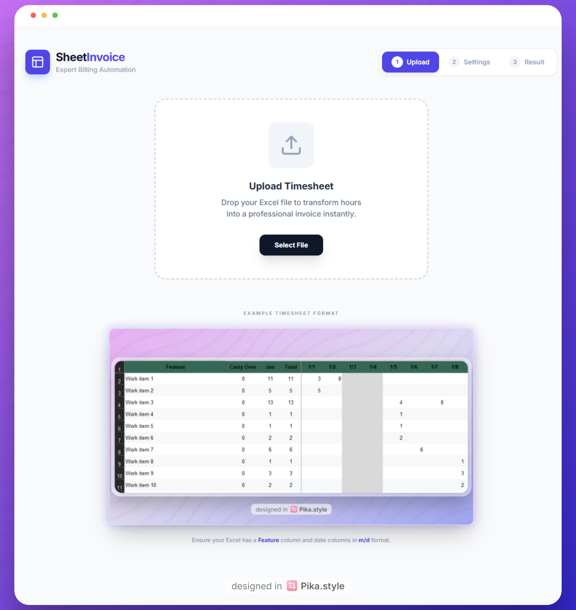
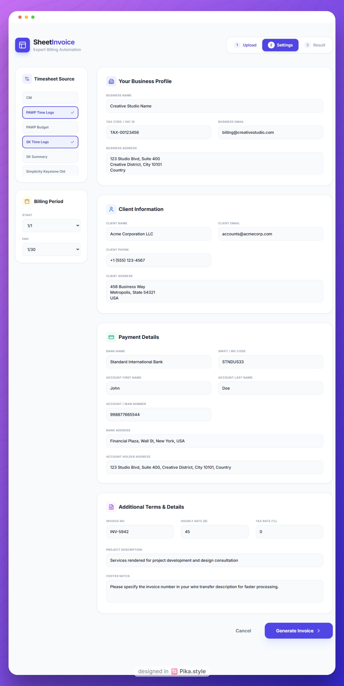
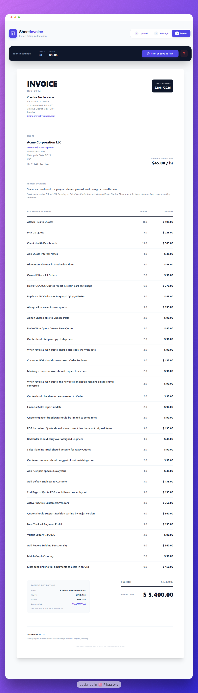

# SheetInvoice 📊

A professional timesheet-to-invoice converter that transforms Excel timesheets into beautifully formatted invoices in seconds.

## ✨ Features

- **📁 Excel Upload** - Drop your timesheet file and instantly parse it
- **📅 Date Range Selection** - Choose specific periods for billing
- **📋 Multi-Sheet Support** - Aggregate hours from multiple Excel sheets
- **⚙️ Customizable Invoice** - Configure all invoice details (company info, rates, taxes, banking)
- **💾 Persistent Settings** - Your configuration is automatically saved locally
- **🖨️ Print-Ready** - Generate professional PDF invoices ready for clients
- **💰 Smart Calculations** - Automatic totals, subtotals, and tax calculations
- **🎨 Modern UI** - Clean, intuitive interface with real-time preview

## 🚀 Quick Start

### Prerequisites

- Node.js 16+ installed
- npm or yarn package manager

### Installation

```bash
# Clone or download the repository
cd timesheet2invoice

# Install dependencies
npm install

# Start development server
npm run dev
```

### Build for Production

```bash
npm run build
npm run preview
```

## 📝 How to Use

### Step 1: Upload Timesheet



Upload an Excel file (.xlsx or .xls) containing your time tracking data. Your Excel should have:
- A **Feature** column (describes the work item/task)
- Date columns in **m/d** format (e.g., 1/15, 12/31)
- Hours logged under each date column

Example format:
```
| Feature              | 1/1  | 1/2  | 1/3  |
|---------------------|------|------|------|
| UI Development      | 4.5  | 3.0  | 2.5  |
| Backend API         | 2.0  | 5.0  | 4.0  |
| Code Review         | 1.0  | 0.5  | 1.5  |
```

### Step 2: Configure Invoice



**Select Sheets**: Choose which Excel sheets to include in the invoice

**Date Range**: Pick start and end dates to filter billable hours

**Invoice Settings**: Customize all details including:
- Company information (name, tax code, address, email)
- Client details (name, email, address, phone)
- Pricing (hourly rate, currency, tax rate)
- Banking information (bank name, SWIFT, account details)
- Invoice number and date
- Service description and payment notes

All settings are saved automatically and will persist between sessions.

### Step 3: Generate Invoice



Review the generated invoice with:
- Itemized breakdown by feature
- Hours worked per item
- Calculated amounts
- Subtotal, tax, and grand total
- Professional formatting with your branding

Use the **Print** button to save as PDF or print directly.

## 🛠️ Tech Stack

- **React 19** - UI framework
- **TypeScript** - Type safety
- **Vite** - Build tool and dev server
- **SheetJS (XLSX)** - Excel file parsing
- **Lucide React** - Icon library
- **Tailwind CSS** - Styling (via classes)

## 📁 Project Structure

```
timesheet2invoice/
├── App.tsx                 # Main application component
├── components/
│   └── InvoiceTemplate.tsx # Invoice rendering component
├── types.ts                # TypeScript type definitions
├── index.tsx               # Application entry point
├── index.html              # HTML template
├── assets/                 # Static assets (example images)
├── package.json            # Dependencies
├── tsconfig.json           # TypeScript configuration
└── vite.config.ts          # Vite configuration
```

## 💡 Tips

- Keep your timesheet format consistent with a "Feature" column
- Use m/d date format for column headers (e.g., 1/15, not 01/15/2025)
- Your invoice configuration persists in browser localStorage
- Click the reset button to start over with a new timesheet
- Use the navigation steps to go back and adjust settings

## 📄 License

This project is available for personal and commercial use.

## 🤝 Contributing

Contributions, issues, and feature requests are welcome!

---

Made with ❤️ for freelancers, consultants, and service providers
